## There are some important random terms

<br>
> - Generalizability
  - How applicable is a finding to the general population
  
> - P-value
  - Probability of finding a value this extreme by random chance
  
> - Confidence Interval
  - Interval over which population value is found with a specified probability (e.g. 95%)
  
> - Efficacy
  - Performance of treatment under ideal circumstances
  
> - Effectiveness
  - Performance of treatment under real world circumstances

--- &vcenter
## Precision is repeatability, Accuracy is closeness


--- .segue
## Describing Distributions

--- &twocol
## Statistical distributions have invariant properties

***=left
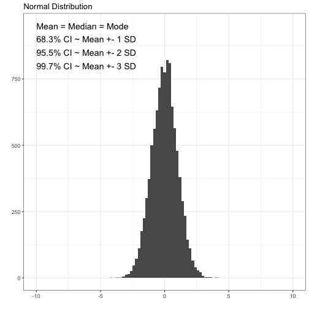

***=right
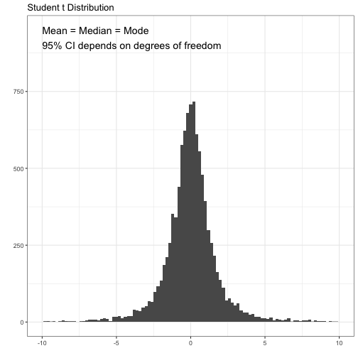

---  &radio
## Question #1

Investigators are studying prostate specific antigen (PSA) as a predictor for prostate cancer. To make the statistics easier, they are going to assume that PSA is a normally distributed population variable. Which of the following is correct under their assumption?

1. Mode is greater than median
2. Median is greater than mode
3. 95% CI depends on degrees of freedom
4. _Median is equal to mean_
5. Mean is equal to standard deviation

***.hint
The normal distribution is unimodal and symmetric.

***.explanation
The important invariant properties (for you) of normal distributions are the following:

1. Mean = Median = Mode
2. Unimodal
3. Symmetric
4. Area under curve is 1
5. Constant relationship between standard deviation and percentiles

--- &twocol
## Real distributions can have one or multiple peaks

***=left


***=right
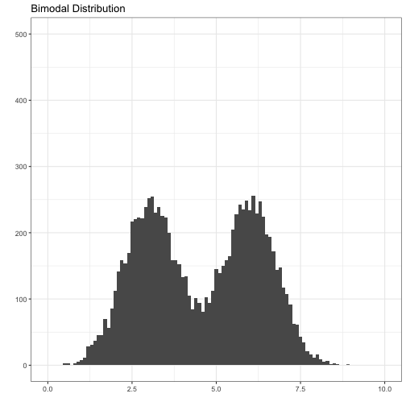

--- &twocol
## Skew describes the direction of the tail

***=left
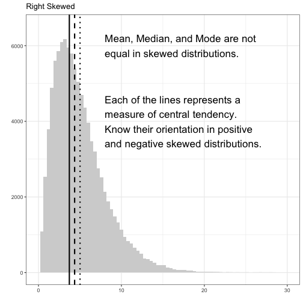


***=right
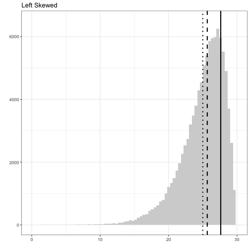

--- &radio2
## Question #2

Which of the following corresponds to the measures of central tendency on the graph from **left to right**? 

1. mean, median, mode
2. mode, mean, median
3. median, mode, mean
4. _mode, median, mean_
5. mean, mode, median

 
***=image
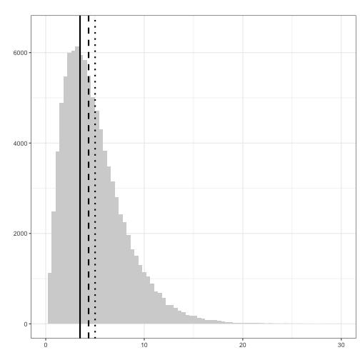

***.hint
Mode is most common, median is middle, mean is average value.

***.explanation
Always remember that the y-axis on these plots are counts or frequency. Therefore, which line is closest to the peak on the y-axis is the mode. The median is **always** in the middle. The mean is the most susceptible to outliers so in a skewed distribution it will **always** be farthest out on the tail.

--- .segue
## Hypothesis Testing

---
## The null hypothesis (\(H_0\)) is always the default

<br>
> - Assume:
  - There are two or more groups being compared, or 
  - One group being compared to zero, or
  - One group is being compared to expectation.

<br>
> - For Step 1, probably safe to assume null is always rejected with \(p < 0.05\).
  - For ratios (e.g. Relative Risk, Odds Ratio), a 95% CI __not__ overlapping 1 is significant.
  - For two sample tests, it is less straightforward how the CI relates to the p-value

<br>
> - Once \(H_0\) is rejected, we accept the alternative hypothesis \(H_A\).

--- &twocol
## T-test compares means of one or two groups

***=left
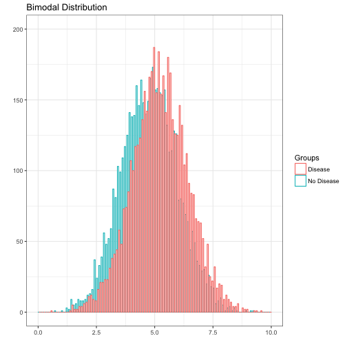

***=right 
<br><br>
> - One sample: \(H_0\) = There is no difference between group mean and zero
<br><br>
> - Two sample: \(H_0\) = There is no difference between the disease and no disease groups
<br><br>
> - Paired: \(H_0\) = The difference of a measured variable between two time points on the same individuals is zero

--- &vcenter
<div class="centered"><font size="7">Will the plot be significant?</font size></div>

---
## T-test compares means of one or two groups

 <br>
 - Two sample: \(H_0\) = There is no difference between the disease and no disease groups
 
 - Run the t-test
  
  ```r
  norm1 <- rnorm(5000, mean = 4.75, sd = 1.2)
  norm2 <- rnorm(5000, mean = 5.25, sd = 1.2)
  (t.test(norm1, norm2))$p.value
  ```
  
  ```
  ## [1] 4.687206e-88
  ```
  <br>
  > - Have we rejected the null hypothesis?
  
  > - Yes, we have accepted \(H_A\). There is a difference between disease and no disease groups.

---

## Interactive tool comparing significance

<iframe src=http://meyerapps.org/statistical_biological_significance/></iframe>

---
## Chi-squared test uses categorical (count) data

<br>
> - Two common tests
 - Goodness-of-fit
 - Test of independence
> - Goodness-of-fit
 - \(H_0\): The number of cases occuring in a subgroup is consistent with expected
 - \(H_A\): The number of cases occuring in a subgroup is not consistent with expected
> - Test of independence
 - \(H_0\): Categorical variable A and categorical variable B are independent
 - \(H_A\): Categorical variable A and categorical variable B are not independent

--- &vcenter
## Always expect a contingency table for chi-squared

|             | Healthy  | Disease  | Total  |
|-------------|---------:|---------:|-------:|
| Exposed     |     40   |     60   |   100  |   
| Not Exposed |    500   |    400   |   900  |   
| Total       |    540   |    460   |  1000  |   
Table 1: A 2x2 contingency table


| Exposure Status | Never Sick  |  Sometimes Sick | Mostly Sick  | Total  |
|-----------------|------------:|----------------:|-------------:|-------:|
| High            |      10     |     20          |   180        |  210   |
| Medium          |      20     |    100          |    20        |  140   |
| Low             |     100     |     40          |    10        |  150   |  
| Total           |     130     |    160          |   210        |  500   |
Table 2: A 3x3 contingency table

--- &vcenter
## The contingency table can be of any size

| Exposure Status | Never Sick  |  Infrequently Sick |  Sometimes Sick |  Mostly Sick |  Always Sick |  Total |
|-----------------|------------:|-------------------:|----------------:|-------------:|-------------:|-------:|
| Super High      |     10      |          90        |       34        |      12      |    12        |   158  |
| Very High       |     30      |         345        |       54        |      43      |    21        |   493  |
| High            |     70      |          57        |       67        |      65      |    32        |   291  |
| Medium          |    200      |          33        |       87        |      25      |    42        |   387  |
| Low             |    130      |          89        |       58        |      45      |    56        |   378  | 
| Very Low        |    100      |          54        |       36        |      23      |    78        |   291  |
| Super Low       |     90      |          23        |       36        |      63      |     8        |   220  |
| Total           |    530      |         691        |      372        |     276      |   249        |  2118  |
Table 3: A 7x5 contingency table

--- &vcenter
## Pearson correlation compares two variables
The correlation can be positive or negative

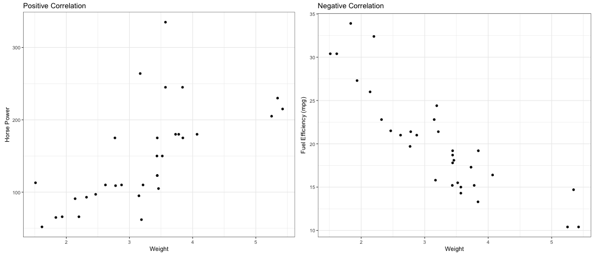

--- &twocol
## For correlation, r is the critical statistic
***=left
<br>
> - Must be quantitative data
 - **Not count data**

<br>
> - \(r =\) correlation between variables

> - \(r^2 = \) amount of variance in y that is explained by x

<br>
> - p-value is still used for significance
 - For Step 1, most likely significant at \(p < 0.05\)

***=right
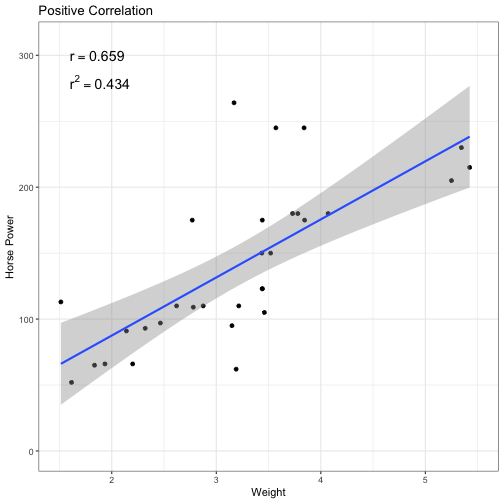

--- &twocol
## A wider spread in \(y\) means a lower \(r^2\)

***=left
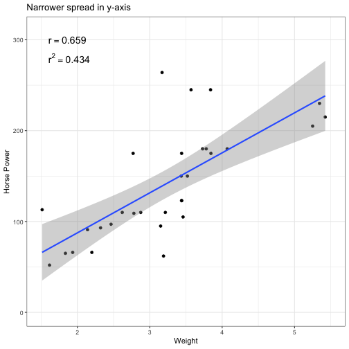

***=right
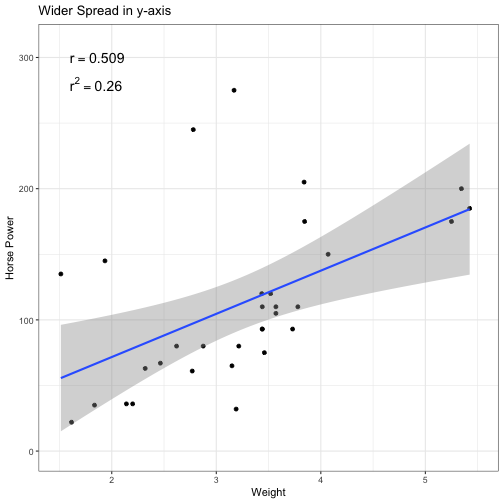

--- &radio2
## Question #3

A study was conducted on OCPs and blood clots, and the data is shown. Which of the following is the best method to assess the association between OCP use and blood clots?

1. Two sample T-test
2. Analysis of variance
3. Pearson correlation
4. _Chi-square test_
5. Spearman correlation

***=image
|             |   Clot   | No Clot  | Total  |
|-------------|----------|----------|--------|
| OCP Use     |    500   |    400   |   900  |   
| No OCP Use  |     80   |     20   |   100  |   
| Total       |    580   |    420   |  1000  |   

***.hint
What kind of data is this?

***.explanation
The only test available that utilizes categorical data is the Chi-square test. All of the other tests require at least rank or quantitative data.

---  &radio
## Question #4

To test a new biomarker, investigators plan a cross-sectional study comprised of two groups. In one group, the researchers will include men with confirmed prostate cancer. In the other group, researchers will include men with no evidence of prostate cancer. The investigators will assume their biomarker is normally distributed. What is the best test to investigate whether the biomarker can distinguish the two groups?

1. Two sample Mann-Whitney U-test
2. Pearson correlation
3. _Two sample T-test_
4. Chi-squared test
5. Analysis of variance

***.hint
The number of groups and distribution is all that matters

***.explanation
The two sample T-test is the appropriate test in this case. The two sample Mann-Whitney U-test could work as well, but is slightly less efficient for normally distributed data than the T-test. The Pearson correlation requires two measured variables on the same sample. A chi-squared test requires categorical (i.e. count) data. An analysis of variance is typically used to measure the difference in means of three or more groups.

--- &twocol
## Hypothesis testing has four possible outcomes

***=left


***=right
<br>
> - Correct - Reject a false \(H_0\)
 - Probability of success is called "power"
 - Power depends on sample size
 - bigger sample = bigger power
> - Correct - Fail to reject a true \(H_0\)
 - Probability determined by \(\alpha\) as \(1-\alpha\)
> - Type 1 - Incorrect rejection of a true \(H_0\)
 - False Positive
> - Type 2 - Failure to reject a false \(H_0\)
 - False Negative

--- .segue
## Epidemiology

---
## Types of prevention

<br>
> - __P__rimary - __P__revention
  - An action taken to prevent development of disease in a person who is well
  <br>
> - __S__econdary - __S__creening
  - Identifying people in whom disease has begun but who do not have signs or symptoms
  <br>
> - __T__ertiary - __T__reatment
  - Preventing complications in those who have developed signs and symptoms and have been diagnosed
  <br>
> - __Q__uaternary - __Q__uit overtesting and overtreating
  - Recent effort to minimize excessive healthcare interventions in disease process

--- &vcenter
## Endemic vs Sporadic vs Epidemic vs Pandemic


---
## Statistic differences lie in setting and time frame

<br>
> - Attack rate
  - Typically used __during epidemics or pandemics__
  - Number of people who get disease / Number of people at risk

> - Incidence
  - Given a __defined period of time__
  - Number of people who get disease / Number of people at risk

> - Prevalence
  - __No time course__ (i.e. measured at a single point in time)
  - Number of people with disease / Number of people at risk
  - Simple diseases (e.g. SIR infections): Prevalence = Incidence x Average Disease Duration

--- &twocol

## Odds and risk connect disease with exposure

***=left

> - Odds 
  - Risk that someone with an exposure will get disease
> - Odds ratio (OR)
  - Excess odds of exposure of one population relative to another
> - Risk - __Must know disease prevalence__
  - __Probability__ that someone with an exposure will get a disease
> - Risk Ratio (Relative Risk or RR)
  - Excess risk of one population relative to another
> - Both significant if CI does not include 1

***=right


--- &radio
## Question #6

Investigators are studying the association between mesothelioma and asbestos exposure. Due to the relative rarity of the disease, they design a very large case-control study. In the end, they find an \(OR = 20 (19.54;20.52, p < 0.001)\). After assuming that the OR is a good approximation of risk, the authors conclude that the risk of mesothelioma is 20 times higher in those exposed to asbestos compared to control. Why is their assumption reasonable?

1. _The incidence of mesothelioma in the population is low_
2. The sample size of this study is very large
3. The result is highly significant
4. The OR is always a good approximation of outcome risk
5. The 95% CI is very narrow around the OR of 20

***.hint
Think about the denominators for odds and risks.

***.explanation
The odds ratio is (A / B) / (C / D) and the risk ratio is (A / (A + B)) / (C / (C + D)). In the case where the number of people with the disease is small, the numbers A and C become very small. In that case, B is a good approximation of A + B and D is a good aproximation of C + D. Thus, the RR ~ (A / B) / (C / D).

--- &vcenter
## OR approximates RR in low prevalence diseases


__If true infections are low, denominator \(A+B \approx B\) and \(C+D \approx D\)__

--- &radio
## Question #7

Two studies were conducted on different samples from the same population to assess the relationship between oral contraceptive use and the risk of deep venous thrombosis (DVT). Study A showed an increased risk of DVT among oral contraceptive users, with a relative risk of 2.0 and a 95% CI of 1.2-2.8. Study B showed a relative risk of 2.05 and a 95% CI of 0.8-3.1. Which of the following statements is most likely to be true regarding these 2 studies?

1. The p-value in study B is likely to be < 0.05
2. The result in study A is not accurate
3. The result in study A is not statistically significant
4. The result in study B is likely biased
5. _The sample size is likely smaller in study B than study A_

***.hint
What gives a narrower confidence interval?

***.explanation
1. Incorrect - The CI in study B overlaps 1 so it is not significant
2. Incorrect - It is hard to judge accuracy without knowing the objective Truth
3. Inccorect - The CI in study A does not include 1 so it is statistically significant
4. Incorrect - There is no reason to believe B is biased
5. Correct - Per slide 23/38 bigger sample leads to improved ability to reject a false null hypothesis

--- &twocol
## Absolute risk reduction is a risk difference

***=left
> - Reminder
  - Exposed: \(Risk = \frac{A}{A + B}\)
  - Unexposed: \(Risk = \frac{C}{C + D}\)
<br><br>
> - \(AR = Risk_{Exposed} - Risk_{Unexposed}\)
> - \(ARR = Risk_{Control} - Risk_{Treatment}\)
<br><br>
> - Number needed to treat
  - Number of patients treated for __ONE__ patient benefited
  - \(NNT = \frac{1}{ARR}\)
  - \(NNH = \frac{1}{AR}\)

***=right


--- &vcenter
## Tests are usually cutoffs on a continuous variable
  
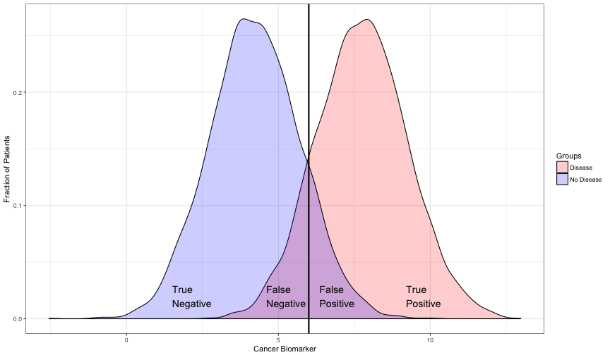

--- &vcenter
## Sensitivity: Efficiency of finding **TRUE POSITIVES** in Real Positives
  
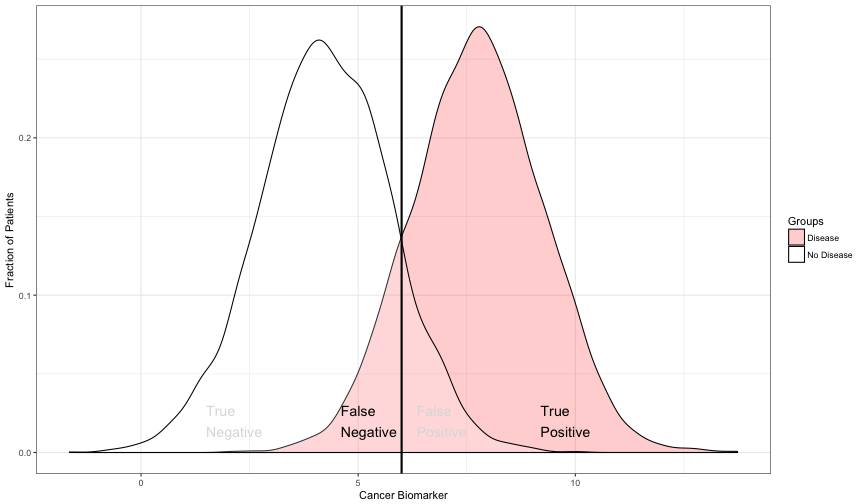

--- &vcenter
## Specificity: Efficiency of finding **TRUE NEGATIVES** in Real Negatives
  
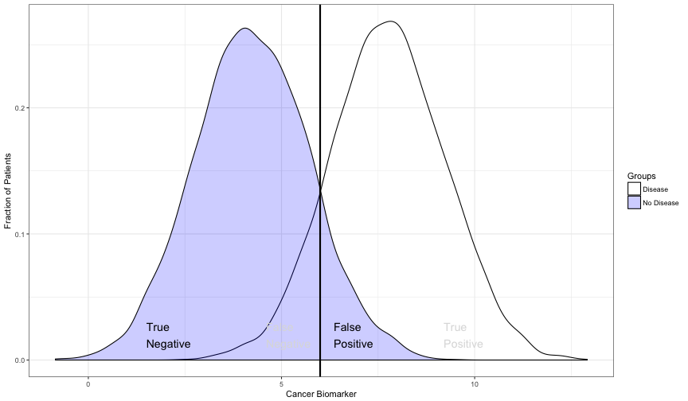

--- &twocol
## Sensitivity and Specificity are critically important for all of medicine
> - __These quantities are the defining characteristics of any clinical test__.
  - They do not depend on anything except the test.

<br>

> - If someone quotes the prositive or negative predictive value of a test, they are wrong.

<br>

> - Therefore, if you do not know the sensitivity or specificity of a test, you are missing information
  - Without sensitivity and specificity, you cannot make a ROC curve
  - Never trust a paper, poster, or company presentation that does not include an ROC curve
  
***=left
<br>
> - __Sensitivity__
> - \(Sensitivity = \frac{TruePositives}{AllRealPositives}\)
> - \(AllRealPositives = TP + FN\)

***=right
<br>
> - __Specificity__
> - \(Specificity = \frac{TrueNegatives}{AllRealNegatives}\)
> - \(AllRealNegatives = TN + FP\)

--- &vcenter
## Sensitivity and specificity are continuous in clinical tests


--- &twocol
## Unlike Sens and Spec, PPV and NPV vary with pre-test probability

***=left
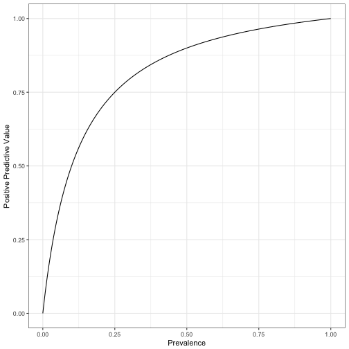

***=right
> - Positive Predictive Value
  - Chance that person has the disease after a positive test result
  - \(PPV = \frac{TP}{TP + FP}\)
<br><br>
> - Negative Predictive Value
  - Chance that person does not have disease after a negative test result
  - \(NPV = \frac{TN}{TN + FN}\)
<br>  
> - __Both depend on how prevalent the disease is in the population__

--- &vcenter
<div class="centered"><font size="6">PPV depends more on sensitivity or specificity?</font size></div>

--- &twocol
## PPV ~ Specificity and NPV ~ Sensitivity

***=left
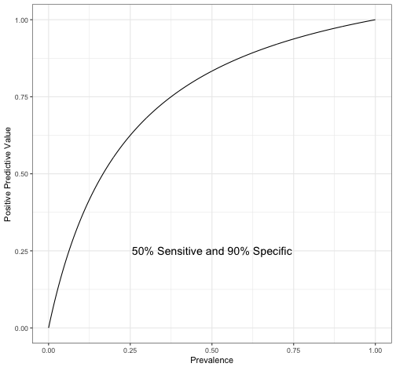

***=right
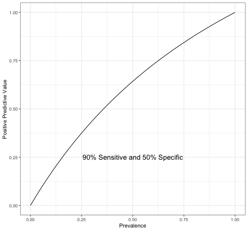

---

## Interactive app to test predictive value

<iframe src=http://meyerapps.org/predictive_value_shiny/></iframe>

--- &vcenter
## This is what real diseases look like in the population
  
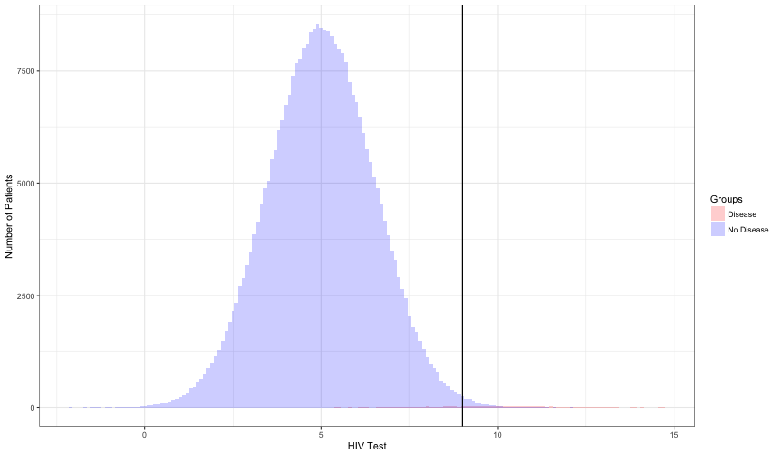

 This is the real prevalence of HIV... Where would you put the cutoff?

--- &radio2
## Question #5

Assume a steady-state population that is not changing in anyway. Which of the following statements is true for people who test positive regarding moving the cutoff for a positive test from the solid to the dotted line?

1. Decrease in test specificity
2. Increase in test sensitivity
3. _Increase in PPV_
4. Increase in NPV
5. Decrease in NPV

***=image
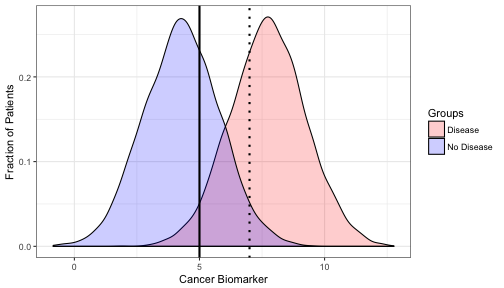

***.hint
Question prefaces a positive test result

***.explanation
1. Incorrect - Moving the line to the right increases the specificity because it captures more true negatives as a portion of total negative individuals
2. Incorrect - Moving the line to the right decreases the sensitivity because it captures fewer true positives as a portion of total positive individuals
3. Correct - Moving the line to the right increase positive predictive value drives up the portion of true positives to total positive test by reducing the number of false positives
4. Incorrect - The question is concerned about positives tests which do not factor into negative predictive value
5. Incorrect - The question is concerned about positives tests which do not factor into negative predictive value

---
## ROC curves visually define clinical test value


> - If the curve approximates the __diagonal__, it is a __bad test__
  - \(AUC = 0.5\) for a bad test
> - If the curve goes up the y-axis and then turns right down x-axis, it is a perfect test
  - \(AUC = 1\) for a perfect test

--- &vcenter
## ROC curves also establish the optimal dichotomous cutoff


__The best cutoff is the x-value that maximizes the distance from the diagonal to the curve__

--- &vcenter
## With the optimal cutoff found, it maps to clinical test results


__Again, the best cutoff is the x-value that maximizes the distance from the diagonal to the curve__

--- .segue
## Minimal Bayesian statistics

---
## Motivation.. In medicine, frequentist statistics is not too useful

<br>
> - The value lies in the intuitive approach

<br>
> - Frequentist: goal is to approximate objective truth through repeated trials
  - The important metric is the probability that our estimate does __not__ match reality
  
<br>
> - Bayesian: goal is to approximately objective truth by updating prior probability with new evidence
  - The important metric is the probability that our subjective experience matches reality

<br>
> - Example: given a clinical test, which do you care more about?
  - If your patient has disease, there is a 2% chance of getting a test result this extreme by chance.
  - If your patient has a positive test, there is a 75% chance of having disease.

--- 
## Basic structure involves adding new information to probability

<br>
> - Start with pre-test probability
  - This data is available all over the place
  - Example: Region 6 prevalence of influenza right now is __\(\approx 4\%\)__
  
<br>
> - Do something (e.g. rapid flu test)
  - Flu test: __\(Sensitivity \approx 70\%\)__ and __\(Specificity \approx 95\%\)__
  - If positive, use likelihood ratio positive (a.k.a. bayes factor positive)
    - __\(LR+ = \frac{sensitivity}{1 - specificity} = \frac{0.7}{1 - 0.95} = 14\)__
  - If negative, use likelihood ratio negative (a.k.a. bayes factor negative)
    - __\(LR- = \frac{1 - sensitivity}{specificity} = \frac{1 - 0.7}{0.95} = 0.32\)__

---
## Adjust probability with the following procedure

<br>
> - Pre-test Probability \(\rightarrow\) Pre-test Odds \(\rightarrow\) Pre-test Odds x LR \(\rightarrow\) Post-test Odds \(\rightarrow\) Post-test Probability

<br>
> - Probability \(\rightarrow\) Odds: \(O = \frac{P}{1 - P}\)
> - Odds \(\rightarrow\) Probability: \(P = \frac{O}{1 + O}\)

<br>
> - Positive test: \(0.04 \rightarrow 0.04/0.96 = 0.042 \rightarrow 0.042 * 14 = 0.583 \rightarrow 0.583/1.583 = 0.37\)
  - Post-test probability following __positive__ test: __\(35\%\)__

<br>
> - Negative test: \(0.04 \rightarrow 0.04/0.96 = 0.042 \rightarrow 0.042 * 0.32 = 0.0134 \rightarrow 0.0134/1.0134 = 0.0132\)
  - Post-test probability following __negative__ test: __\(1.32\%\)__
  - So this time of year a negative test is basically useless

---
## Example: probability of pneumococcal pneumonia given +CXR

<iframe src=http://meyerapps.org/pneumococcal_etiology_hiv/></iframe>

--- .segue
## Types of Biases - My groupings

---
## Biases of design or unseen variables

<br>
> - Selection bias
  - Non-random partitioning of individuals into groups
> - Observer-expectancy
  - Observer is unblinded and expects a particular outcome
> - Effect modification bias
  - Magnitude of effect varies by third variable
  - __Can__ be eliminated by stratification
> - Confounding
  - Unseen third variable is an underlying cause for correlation of two other variables
  - __Cannot__ be eliminated by stratification

---
## Biases of information (measurement)

<br>
> - Recall bias
  - Subjects with disease can recall exposures better than healthy subjects
  
<br>
> - Procedure bias
  - Experimenters vary systematically in the way they do work
  - e.g. Experimenters don't follow the specified procedure
  
<br>
> - Instrument bias
  - Instrument is broken
  - Instruments can also be things like surveys or __clerkship evaluations__
  - Just means instrument is not reliable

---
## Biases of time and completion

<br>
> - Lead-time bias
  - New test detects disease earlier
  - Survival appears improved with new test
  
<br>
> - Attrition bias
  - Subjects systematically withdraw
  - Could be things like side effects or lack of improvement
  
<br>
> - Loss-to-follow up
  - Subjects randomly do not report for scheduled followup

--- .segue
## Types of studies

--- &vcenter
## The pyramid of evidence is a hierarchy


__Closer to the top means better evidence__

--- &vcenter
<div class="centered"><font size="7">Experimental Trials</font size></div>

--- &vcenter
## Randomized control trial is in the name


---
## Randomized control trials are the gold standard

<br>
> - This is widely considered the gold standard for clinical evidence

<br>
> - Question: __Primary__ purpose of randomization?
> - Answer: To eliminate __selection bias__
  - Selection bias is eliminated if randomization is technically correct

<br>
> - Question: Secondary goal of randomization?
> - Answer: To control confounders
  - Confounders are not necessarily eliminated even with perfect technical execution

<br>
> - Can use relative risk because investigator knows prevalence of disease and prior exposures

---
## Crossover trial means the two groups switch


 <br>
 - This post hoc analysis is overly simplified for real life
 
 - This understanding is sufficient for step 1
 
 - Confounders reduced because a patient can serve as their own control

--- &vcenter
<div class="centered"><font size="7">Observational Studies</font size></div>

--- &vcenter
## Prospective cohorts follow groups into the future


--- &vcenter
## Retrospective cohorts follow groups from the past


---
## Cohorts form the next level of evidence
 
 <br>
 > - Can use relative risk because investigator knows prevalence of exposure and disease
 > - Subjects vary by exposure status
 > - Can calculate incidence
 
 <br>
 > - __Selection bias__ is the biggest problem
   - Investigator has infinite control over inclusion
 > - Other biases
   - Attrition, loss-to-follow up, confounding, Hawthorne
   
 <br>
 > - Retrospective
   - Information bias

--- &vcenter
## Case-control trials measure chance of exposure given disease


---
## Case-control forms the next level down from cohorts
 <br>
 > - Must use odds ratio because investigator does not know prevalence of disease
 > - Subjects grouped by cases and controls
   - Measure __odds of exposure__ in case and control groups
 > - Significantly improved power and decreased resource requirements compared to cohorts 
   - Due to cases being selected at out set
 > - __Selection and Recall biases__ are the biggest problem
   - Selecting appropriate controls is __highly__ non-trivial
   - Sick people remember exposures (e.g. Melanoma patients stew about their sunburns)
 > - Also common
   - Information biases
 > - __Cannot calculate incidence or prevalence__

--- &vcenter
## Cross-sectional trials measure exposure and disease simultaneously


---
## Cross-sectional study form next level evidence

 <br>
 > - __Quick, cheap, and easy__
   - Typically this is a starting point
 > - Can establish prevalence of disease
 > - Must use chi-squared or correlation for statistical test
 > - Subjects can be grouped by exposure and diease in to the 2x2 contingency
 
 <br>
 > - __Cannot establish causation__
 > - Cannot calculate risk metrics

--- &radio
## Question #8
A study was conducted to evaluate the efficacy of a new antiviral drug for the treatment of the common cold in young children. The study population consisted of 100 children between the age of 2 to 8 years. These children were diagnosed with rhinovirus infection and subsequently given the particular antiviral drug. One week later, it was observed that 92 of the 100 patient were asymptomatic. Which of the following is the true conclusion of this study?

1. The drug is highly effective as the effectiveness is 90%
2. The drug is moderately effective as the efficacy is 90%
3. _An exact conclusion cannot be drawn from the study_
4. The drug is not effective as the sample size is very small
5. No conclusion can be made, as compliance is generally very low in small children

***.hint
A treatment is tested without a control

***.explanation
1. Incorrect - We can't compare to a real-world control.
2. Incorrect - We can't compare to an ideal control.
3. Correct - Most people with recover from a cold in a week or so.
4. Incorrect - The sample size may be adequate. There are no statistical tests to evaluate this statement.
5. Incorrect - Compliance would not be an issue in this case.

--- &radio
## Question #9
Researchers are studying the relationship between mutations in HMG-CoA reductase and CAD. The study population is selected at random. Tissue samples are obtained for genotyping and stress echos are performed to assess CHD. In the subsequent paper, the authors conclude that there is an association between mutations in HMG-CoA reductase and CHD. Which of the following study designs did the authors utilize?

1. Retrospective cohort study
2. _Cross-sectional study_
3. Randomized clinical trial
4. Prospective cohort study
5. Case-control trial

***.hint
What does the timeline look like?

***.explanation
1. Incorrect - A retrospective cohort starts at some point in the past. There is no indication of a past time or chart review in this study.
2. Correct - A cross-sectional study is a "snap shot". It simultaneously determines both risk factors and disease. It can establish an association, but it cannot say much about causation because the timeline is unknown.
3. Incorrect - Although patients are randomly selected, a random clinical trial requires a control group and requires some treatment under investigation.
4. Incorrect - A prospective cohort starts in the present and follows a group into the future. There is no indication of time or following patients or recording expsoure.
5. Incorrect - A case-control trial requires identifying cases with disease and controls without disease, then identifying exposures, and calculating the risk of exposure in given disease. There is no indication of that here.

--- &radio
## Question #10
A study was conducted to evaluate the efficacy of a new antiviral drug. The study population consisted of 100 rhinovirus-infected children. The treatment arm was given an antiviral drug and the control arm was given a placebo. One week later, researchers found that 42 out of 50 treatment patients were asymptomatic and 30 of 50 control patients were asymptomatic. On average, how many people need to be treated with this drug to cure __one__ infected person?

1. 25/12
2. _50/12_
3. 50/15
4. 24/7
5. 50/8

***.hint
\(ARR = Risk_{Control} - Risk_{Treatment}\)

\(NNT = \frac{1}{ARR}\)

***.explanation
\(ARR = \frac{42}{50} - \frac{30}{50} = \frac{12}{50}\)

\(NNT = \frac{1}{12/50} = \frac{50}{12}\)

--- .segue
## One clinical application

--- &vcenter
## A little controversy


--- &vcenter
## Subgroup demographics of the patients and physicians


--- &radio2
## Question #11

Assuming that mortality is simply the incidence of death per 100 patients, after controlling for physician characteristics, what is the relative risk of death within 30 days of discharge for patients with a male physician versus a female physician?

1. 11.49
2. 11.07
3. _1.04_
4. 0.96
5. 1.07

***=image


***.hint
\(Incidence_{Male} = \frac{a}{a + b}\)

\(Incidence_{Female} = \frac{c}{c + d}\)

Thus, mortality is the **risk** of death.

***.explanation
Mortality is the **risk** of death. Then, the relative risk is:

\(Risk_{Male} = 11.49\)

\(Risk_{Female} = 11.07\)

\(RR = \frac{11.49}{11.07}\)

--- &radio2
## Question #12

What is the absolute risk reduction of having a female physician?

1. _0.0042_
2. 0.0142
3. 0.0049
4. 0.0064
5. 0.0342

***=image


***.hint
Mortality is the **risk** of death.

\(ARR = Risk_{Male} - Risk_{Female}\)

***.explanation
Mortality is the **risk** of death. Since this is subtraction it is important to have the units correct.

\(ARR = 0.1149 - 0.1107 = 0.0042\)

--- &radio2
## Question #13

Within this study population, on average how many patients would need to be treated by a female physician to save a life?

1. 2.4
2. 8.7
3. 87.1
4. _238.1_
5. 871.4

***=image


***.hint
Mortality is the **risk** of death.

\(ARR = Risk_{Male} - Risk_{Female}\)

\(NNT = \frac{1}{ARR}\)

***.explanation
Thus, mortality is the **risk** of death. Since this is subtraction it is important to have the units correct.

\(ARR = 0.1149 - 0.1107 = 0.0042\)

\(NNT = \frac{1}{ARR} = \frac{1}{0.0042} = 238.1\)

--- &radio2
## Question #14

Within the context of this study, if we no longer allowed men to treat general medicine patients approximately how long on average would it take for a female physician to save a patient that otherwise would have died under the previous treatment system?

1. 2 months
2. 8 months
3. _1.5 years_
4. 3.5 years
5. 5 years

***=image


***.hint
Approximately how many individual study patients are being seen each year by the physicians in this study?

***.explanation
In this study, between 130 and 180 patients are being seen annually by female and male physicians respectively. Thus, the time to save a patient in years is:

\(\frac{238.1}{131.9} = 1.81\)

\(\frac{238.1}{180.5} = 1.32\)

---
## What might the distribution of physician mortality look like?

<iframe src=http://meyerapps.org/male_female_example/></iframe>

--- &vcenter
<div class="centered"><font size="7">The End</font size></div>
